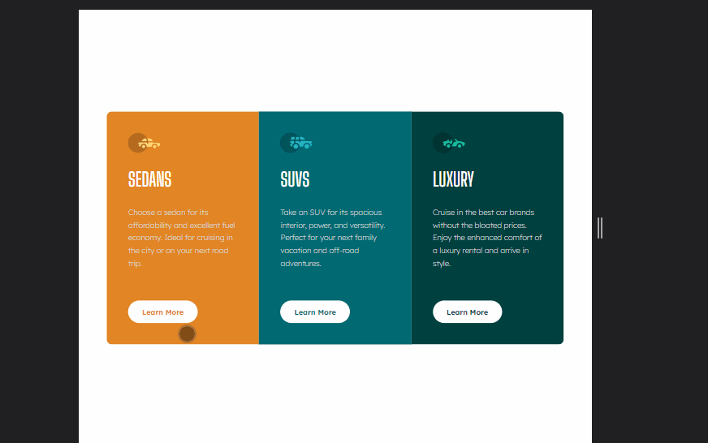
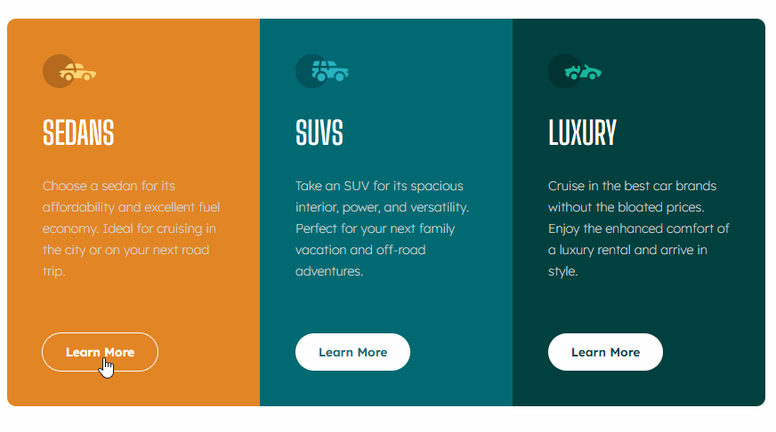

# Frontend Mentor - 3-column preview card component solution

This is a solution to the [3-column preview card component challenge on Frontend Mentor](https://www.frontendmentor.io/challenges/3column-preview-card-component-pH92eAR2-). Frontend Mentor challenges help you improve your coding skills by building realistic projects.

## The challenge

Users should be able to:

- View the optimal layout depending on their device's screen size
- See hover states for interactive elements

## Screenshot



---

- Hover States

  

## Built with

- Semantic HTML5 markup
- SASS
- Flexbox
- CSS Grid
- Mobile-first workflow

## What I learned

Use each individual grid's background to your advantage by using its `background-color`, and set it to their button's CSS hover effects: `background: transparent`.

```scss
.grid {
  & > *:first-child {
    background-color: $bg-color1; //$bg-color: rgb(226, 133, 37);
  }

  & > *:nth-child(2) {
    background-color: $bg-color2; //$bg-color: rgb(1, 105, 114);
  }

  & > *:nth-child(3) {
    background-color: $bg-color3; //$bg-color: rgb(0, 64, 63);
  }
}
```

```scss
&__btn {
  color: currentColor; // $bg-color

  &:hover {
    background: transparent; // $bg-color
  }
}
```

## Author

- Fred Campo
