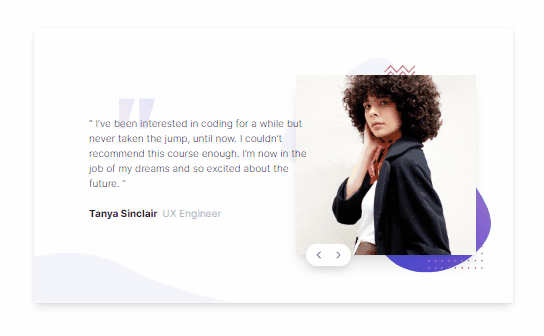

# Frontend Mentor - Coding bootcamp testimonials slider solution

This is a solution to the [Coding bootcamp testimonials slider challenge on Frontend Mentor](https://www.frontendmentor.io/challenges/coding-bootcamp-testimonials-slider-4FNyLA8JL). Frontend Mentor challenges help you improve your coding skills by building realistic projects.

## Table of contents

- [Overview](#overview)
  - [The challenge](#the-challenge)
  - [Screenshot](#screenshot)
- [My process](#my-process)
  - [Built with](#built-with)
  - [What I learned](#what-i-learned)
- [Author](#author)

## Overview

### The challenge

Users should be able to:

- View the optimal layout for the component depending on their device's screen size
- Navigate the slider using either their mouse/trackpad or keyboard

### Screenshot



## My process

### Built with

- Semantic HTML5 markup
- CSS custom properties
- Flexbox
- CSS Grid
- Mobile-first workflow
- Svelte + Typescript
- TailwindCSS

### What I learned

To handle more testimonials, loop through all testimonials and initialize their positions to `next` then dynamically change them base on the user's input for navigating the next slider.

```ts
function updateCurrent(type: 'increment' | 'decrement'): void {
  const currentIndex = testimonials.findIndex(
    (item) => item.position === 'current'
  )

  let current: number, prev: number
  testimonials = testimonials.map((item) => {
    return { ...item, position: 'next' }
  })

  if (type === 'increment') {
    current = currentIndex === testimonials.length - 1 ? 0 : currentIndex + 1
  } else {
    current = currentIndex === 0 ? testimonials.length - 1 : currentIndex - 1
  }
  prev = current === 0 ? testimonials.length - 1 : current - 1

  testimonials[current].position = 'current'
  testimonials[prev].position = 'prev'
}
```

To dynamically update the slider's position when using TailwindCSS use the svelte:class directive to apply tailwind positioning classes

```svelte
<li
  class="absolute inset-0 z-20 grid  place-items-center opacity-0 transition-all duration-1000"
  class:translate-x-0={position === 'current'}
  class:translate-x-full={position === 'next'}
  class:-translate-x-full={position === 'prev'}
  class:opacity-100={position === 'current'}
>
  <Testimonial {...item} />
</li>
```

## Author

- [Fred Campo](https://github.com/fredcamp)
