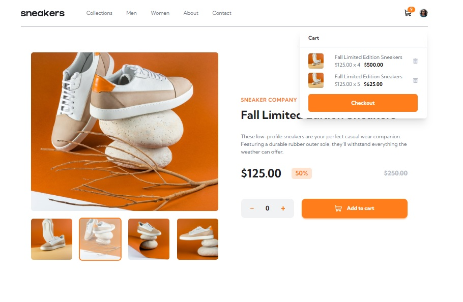

# Frontend Mentor - E-commerce product page solution

This is a solution to the [E-commerce product page challenge on Frontend Mentor](https://www.frontendmentor.io/challenges/ecommerce-product-page-UPsZ9MJp6). Frontend Mentor challenges help you improve your coding skills by building realistic projects.

## Table of contents

- [Overview](#overview)
  - [The challenge](#the-challenge)
  - [Screenshot](#screenshot)
- [My process](#my-process)
  - [Built with](#built-with)
  - [What I learned](#what-i-learned)
- [Author](#author)

## Overview

### The challenge

Users should be able to:

- View the optimal layout for the site depending on their device's screen size
- See hover states for all interactive elements on the page
- Open a lightbox gallery by clicking on the large product image
- Switch the large product image by clicking on the small thumbnail images
- Add items to the cart
- View the cart and remove items from it

### Screenshot



## My process

### Built with

- Semantic HTML5 markup
- CSS custom properties
- Flexbox
- CSS Grid
- Mobile-first workflow
- Svelte
- Typescript
- TailwindCSS

**Note: These are just examples. Delete this note and replace the list above with your own choices**

### What I learned

To display the specific hero component in different viewports (small and large screen devices), we can create both separate components and render them depending on what viewport it falls. Since the **Navigation** and **Hero** Components both have different display. I created a viewport store wherein it tracks on what viewport size it belongs to.

_Viewport Store_

```ts
import { writable } from 'svelte/store'

let isDesktop = createStore(null)

function createStore(initial: boolean) {
  const { subscribe, set } = writable(initial)

  return {
    subscribe,
    set: (value: boolean) => {
      set(value)
    },
  }
}

export default isDesktop
```

To use it on the **Hero Component**, I created two components for the small and large viewports, and render them base on what the value of the store.

_Hero Component_

```html
<script lang="ts">
  import HeroSmall from './HeroSmall.svelte'
  import HeroLarge from './HeroLarge.svelte'
  import isDesktop from '../stores/viewport'
</script>

{#if $isDesktop}
<HeroLarge />
{:else}
<HeroSmall />
{/if}
```

_Main Component_

```html
<script lang="ts">
  let innerWidth = window.innerWidth

  $: if (innerWidth > 1024) {
    $isDesktop = true
  } else {
    $isDesktop = false
  }
</script>

<svelte:window bind:innerWidth />
```

## Author

- Website - [Fred Campo](https://github.com/fredcamp)
