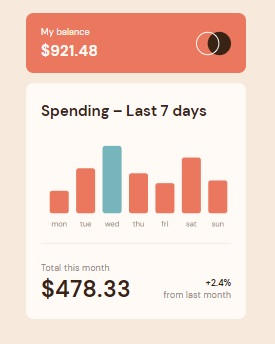

# Frontend Mentor - Expenses chart component solution

This is a solution to the [Expenses chart component challenge on Frontend Mentor](https://www.frontendmentor.io/challenges/expenses-chart-component-e7yJBUdjwt). Frontend Mentor challenges help you improve your coding skills by building realistic projects.

## Table of contents

- [Overview](#overview)
  - [The challenge](#the-challenge)
  - [Screenshot](#screenshot)
- [My process](#my-process)
  - [Built with](#built-with)
  - [What I learned](#what-i-learned)
- [Author](#author)

## Overview

### The challenge

Users should be able to:

- View the bar chart and hover over the individual bars to see the correct amounts for each day
- See the current day’s bar highlighted in a different colour to the other bars
- View the optimal layout for the content depending on their device’s screen size
- See hover states for all interactive elements on the page
- **Bonus**: Use the JSON data file provided to dynamically size the bars on the chart

### Screenshot



## My process

### Built with

- Semantic HTML5 markup
- CSS custom properties
- Flexbox
- CSS Grid
- Mobile-first workflow
- Svelte
- TypeScript
- TailwindCSS
- Chart.js

### What I learned

To integrate **Chart.js** with **Svelte**, you have to make sure you imported the correct path when using **Chart.js** with **npm**.

```ts
import { Chart, type ChartItem } from 'chart.js/auto'
```

Since the chartCanvas would return undefined when the component is rendered, we have to use Svelte's `onMount()` to make sure that the chart would be displayed after the component is rendered.

```html
<script lang="ts">
  import { onMount } from 'svelte'

  let ctx: ChartItem
  let chartCanvas: HTMLCanvasElement
  let myChart: Chart

  onMount(() => {
    displayChart()

    return () => {
      myChart.destroy()
    }
  })

  function displayChart(): void {
    //chart initialization goes here.....
  }
</script>

<canvas class="cursor-pointer" bind:this="{chartCanvas}" />
```

## Author

- [Fred Campo](https://github.com/fredcamp)
