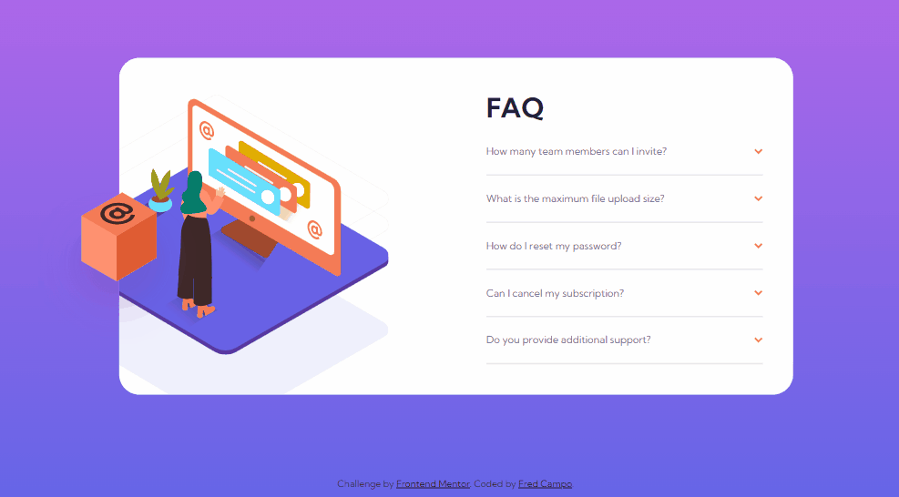
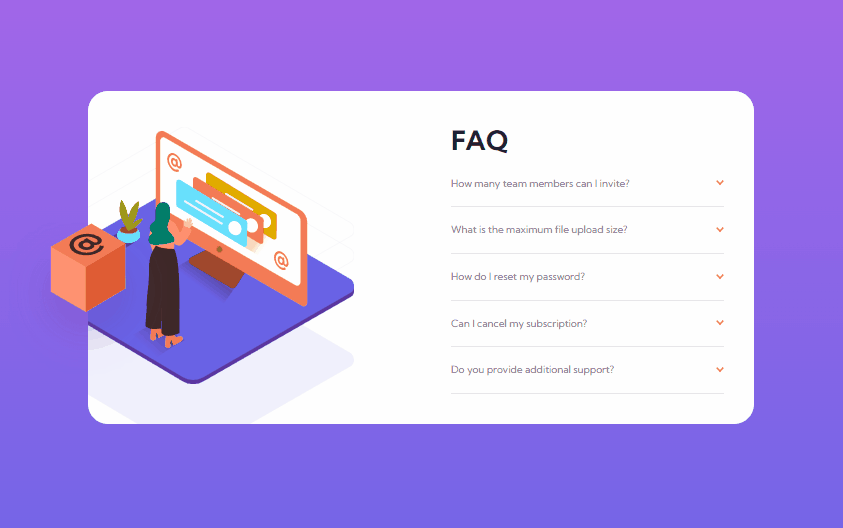
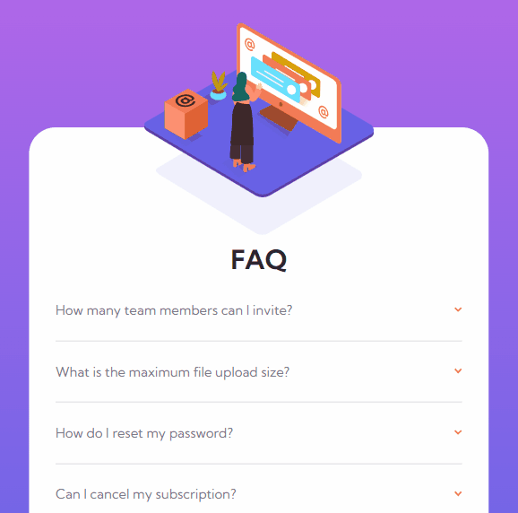

# Frontend Mentor - FAQ accordion card solution

This is a solution to the [FAQ accordion card challenge on Frontend Mentor](https://www.frontendmentor.io/challenges/faq-accordion-card-XlyjD0Oam). Frontend Mentor challenges help you improve your coding skills by building realistic projects.

## The challenge

Users should be able to:

- View the optimal layout for the component depending on their device's screen size
- See hover states for all interactive elements on the page
- Hide/Show the answer to a question when the question is clicked
- Bonus: Complete the challenge without using JavaScript

## Screenshot

- Desktop and Mobile Responsiveness

  

---

- Desktop Hover States

  

---

- Mobile Hover States

  

### Built with

- Semantic HTML5 markup
- SASS
- Flexbox
- CSS Grid
- Mobile-first workflow

## What I learned

- You can use the **checkbox + label** hack instead of using **Javascript** to change the direction of arrows and hide/display the answers by taking it out from its relative flow using `position: absolute` and using negative margin or `opacity: 0`.

```html
<div class="card-question">
  <input type="checkbox" id="card-question__1" />
  <label for="card-question__1" class="card-question__summary">
    <p>How many team members can I invite?</p>
    
  </label>
  <p class="card-question__answer">
    You can invite up to 2 additional users on the Free plan. There is no limit
    on team members for the Premium plan.
  </p>
</div>
```

```scss
input[type="checkbox"] {
  position: absolute;
  opacity: 0;
}

input[type="checkbox"]:checked ~ label > img {
  transform: rotate(-180deg);
}

input[type="checkbox"]:checked ~ p {
  visibility: visible;
  height: auto;
}
```

## Author

- Fred Campo
