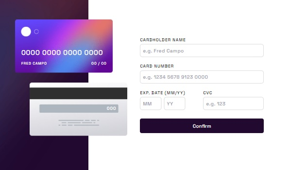

# Frontend Mentor - Interactive card details form solution

This is a solution to the [Interactive card details form challenge on Frontend Mentor](https://www.frontendmentor.io/challenges/interactive-card-details-form-XpS8cKZDWw). Frontend Mentor challenges help you improve your coding skills by building realistic projects.

## Table of contents

- [Overview](#overview)
  - [The challenge](#the-challenge)
  - [Screenshot](#screenshot)
- [My process](#my-process)
  - [Built with](#built-with)
  - [What I learned](#what-i-learned)
- [Author](#author)

## Overview

### The challenge

Users should be able to:

- Fill in the form and see the card details update in real-time
- Receive error messages when the form is submitted if:
  - Any input field is empty
  - The card number, expiry date, or CVC fields are in the wrong format
- View the optimal layout depending on their device's screen size
- See hover, active, and focus states for interactive elements on the page

### Screenshot




## My process

### Built with

- Semantic HTML5 markup
- CSS custom properties
- Flexbox
- CSS Grid
- Mobile-first workflow
- Svelte + Typescript
- TailwindCSS
- RegEx

**Note: These are just examples. Delete this note and replace the list above with your own choices**

### What I learned

How important and powerful **RegEx** can do when it comes to client side validations.

```ts
const regex = /^(\d{4} ?){4}$/
const result = regex.test(input)
```

And how amazing **ES7 String Padding** when displaying output and placeholders.

```ts
function cardParser(card: string): string {
  if (card?.trim().length > 1) {
    card = card.replace(/ /g, '')
  }

  card = card?.trim().length === 0 ? '0' : card || '0'
  card = card.padStart(16, '0')

  const cardArr = card.split('')
  card = ''

  for (let i = 0; i < cardArr.length; i++) {
    if (i % 4 === 0) card += ' '
    card += cardArr[i]
  }

  return card
}
```

## Author

- [Fred Campo](https://github.com/fredcamp)
