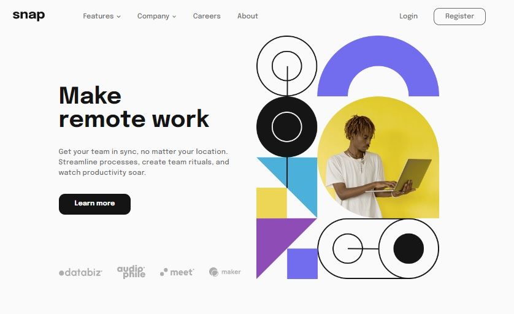

# Frontend Mentor - Intro section with dropdown navigation solution

This is a solution to the [Intro section with dropdown navigation challenge on Frontend Mentor](https://www.frontendmentor.io/challenges/intro-section-with-dropdown-navigation-ryaPetHE5). Frontend Mentor challenges help you improve your coding skills by building realistic projects.

## Table of contents

- [Overview](#overview)
  - [The challenge](#the-challenge)
  - [Screenshot](#screenshot)
- [My process](#my-process)
  - [Built with](#built-with)
  - [What I learned](#what-i-learned)
- [Author](#author)

## Overview

### The challenge

Users should be able to:

- View the relevant dropdown menus on desktop and mobile when interacting with the navigation links
- View the optimal layout for the content depending on their device's screen size
- See hover states for all interactive elements on the page

### Screenshot



## My process

### Built with

- Semantic HTML5 markup
- CSS custom properties
- Flexbox
- CSS Grid
- Mobile-first workflow
- Svelte
- TypeScript
- TailwindCSS

### What I learned

Instead of using **svgs** as images, with **Svelte** we can directly use them as **Svelte Component Icon** by changing _.svg_ into _.svelte_ and export them together with the links so that we can both use them for the **Navbar Component**.

```ts
import TodoIcon from '../icons/icon-todo.svelte'
import CalendarIcon from '../icons/icon-calendar.svelte'
import ReminderIcon from '../icons/icon-reminders.svelte'
import PlanningIcon from '../icons/icon-planning.svelte'

export function createLinks() {
  return [
    {
      page: 'Features',
      links: [
        {
          Icon: TodoIcon,
          page: 'Todo List',
        },
        {
          Icon: CalendarIcon,
          page: 'Calendar',
        },
        {
          Icon: ReminderIcon,
          page: 'Reminders',
        },
        {
          Icon: PlanningIcon,
          page: 'Planning',
        },
      ],
    },
  ]
}
```

## Author

- Website - [Fred Campo](https://github.com/fredcamp)
