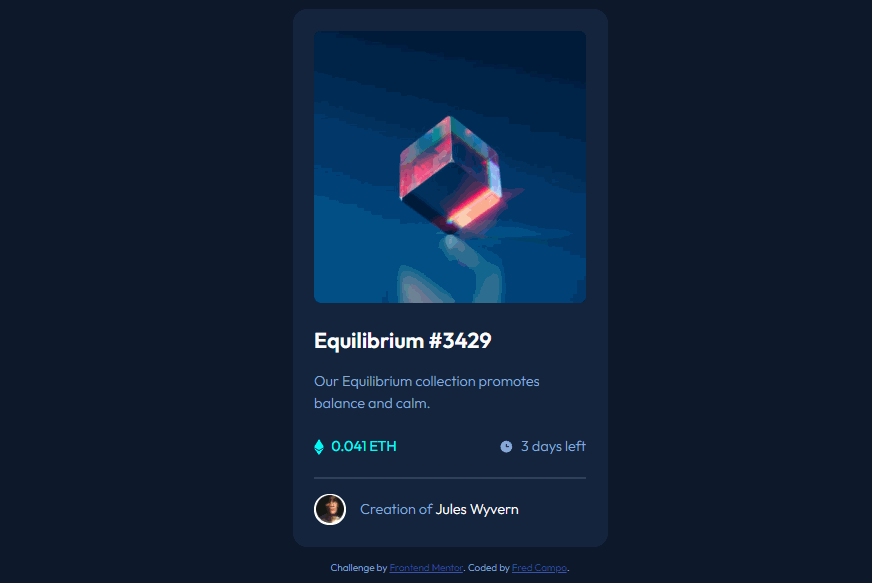

# Frontend Mentor - NFT preview card component solution

This is a solution to the [NFT preview card component challenge on Frontend Mentor](https://www.frontendmentor.io/challenges/nft-preview-card-component-SbdUL_w0U). Frontend Mentor challenges help you improve your coding skills by building realistic projects.

## The challenge

Users should be able to:

- View the optimal layout depending on their device's screen size
- See hover states for interactive elements

## Screenshot



## Built with

- Semantic HTML5 markup
- SASS
- Flexbox
- CSS Grid
- Mobile-first workflow

## What I learned

- You can't add a pseudo-element selector on an `` tag for the hover state. You can use a work-around by wrapping it inside a `<div>` or targeting its parent element to do the CSS styling. It's best to wrap the image description inside a div (especially if it consists alot of contents e.g. texts and buttons). But for this one, I didn't use it since there's only a single icon that needs to be displayed.

```scss
.card-header {
  position: relative;
  border-radius: 0.5em;
  overflow: hidden;

  &::after {
    content: "";
    position: absolute;
    top: 0;
    left: 0;
    height: 100%;
    width: 100%;
    background-color: $accent-color;
  }
}
```

- Since you can't do any sort of transition when using `display: none` to `display: block` property in CSS3. Using `visibility`, `height`, or `opacity` hack would do the trick.

```scss
.card-header {
  &__svg {
    opacity: 0;
    transition: opacity 200ms ease-in-out;
  }

  &::after {
    opacity: 0;
    transition: opacity 200ms ease-in-out;
  }

  &:hover &__svg {
    opacity: 1;
  }

  &:hover::after {
    opacity: 0.4;
  }
}
```

## Author

- Fred Campo
