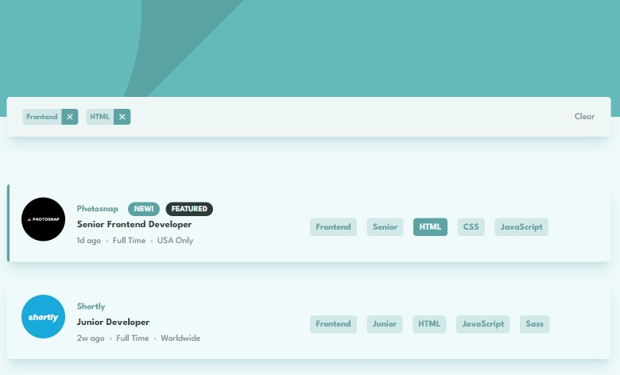

# Frontend Mentor - Job listings with filtering solution

This is a solution to the [Job listings with filtering challenge on Frontend Mentor](https://www.frontendmentor.io/challenges/job-listings-with-filtering-ivstIPCt). Frontend Mentor challenges help you improve your coding skills by building realistic projects.

## Table of contents

- [Overview](#overview)
  - [The challenge](#the-challenge)
  - [Screenshot](#screenshot)
- [My process](#my-process)
  - [Built with](#built-with)
  - [What I learned](#what-i-learned)
- [Author](#author)

## Overview

### The challenge

Users should be able to:

- View the optimal layout for the site depending on their device's screen size
- See hover states for all interactive elements on the page
- Filter job listings based on the categories

### Screenshot



## My process

### Built with

- Semantic HTML5 markup
- CSS custom properties
- Flexbox
- CSS Grid
- Mobile-first workflow
- Svelte
- TypeScript
- TailwindCSS

**Note: These are just examples. Delete this note and replace the list above with your own choices**

### What I learned

How amazing and simple **Svelte's Store** is to use for state management. With the use of the dollar prefix **$** for auto subscription and cleanup.

```ts
import { writable } from 'svelte/store'
import type { JobStore } from '../types/Job.type'

let store = createFilterStore([])

function createFilterStore(initial: string[]): JobStore {
  const { subscribe, set } = writable(initial)

  return {
    subscribe,
    set: (value: string[]) => {
      set(value)
    },
  }
}
export default store
```

Another challenge that I faced was on how to make sure that all the **Filter Tags** would return the exact **Job Listing**. There are lots of ways to use like with the **ES6 Object Entries**, but I just went with the **Object Destructuring** since it was more of a simple head-on approach and used **Svelte's Reactivity** to trigger when value changes.

```ts
//svelte reactivity, so whenever filterStore value changes, the function would execute
$: applyFilter(), $filterStore

function applyFilter(): void {
  if ($filterStore.length === 0) {
    jobs = [...data]
    return
  }

  jobs = data.filter((post) => {
    const { role, level, languages, tools } = post
    const keys = [role, level, ...languages, ...tools]

    const hasAllElements = $filterStore.every((item) => keys.includes(item))
    if (hasAllElements) return post
  })
}
```

## Author

- [Fred Campo](https://github.com/fredcamp)
